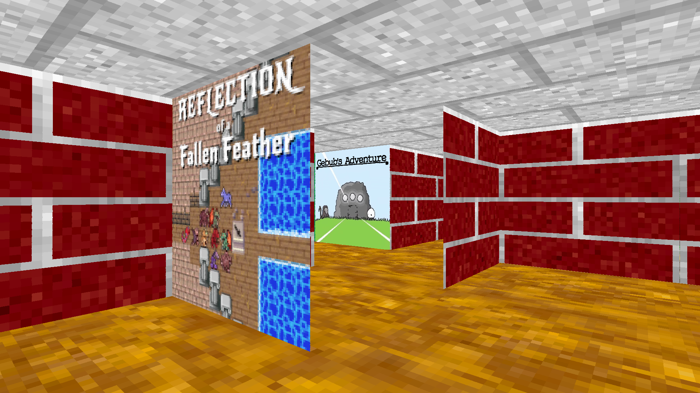
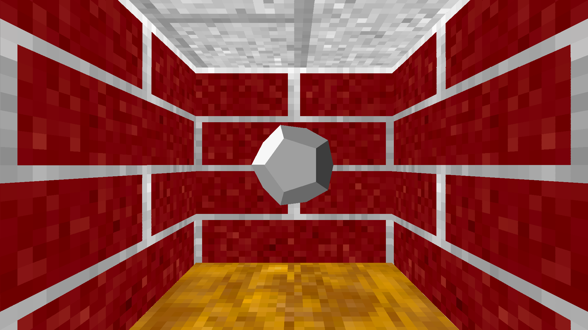

Trailer: https://www.youtube.com/watch?v=bVDx9exXRds

In the 90s I was mesmerized by the 3d maze screensaver on Windows 95. 20 years later I've got the programming skills so I was inspired to make my dream of playing it a reality! Maze95 was also made as a research project to learn about software rendering.

Builds for Linux+Windows can be downloaded on the GameJolt page: https://croakingkero.gamejolt.io/maze95 or Itchio page: https://croaking-kero.itch.io/maze95

# Building
Requires https://gitlab.com/UltimaN3rd/croaking-kero-c-libraries
And https://github.com/nothings/stb/blob/master/stretchy_buffer.h
